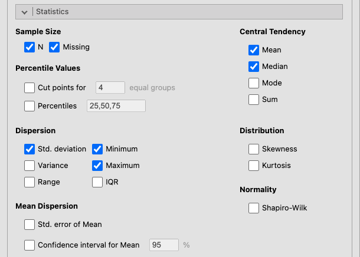
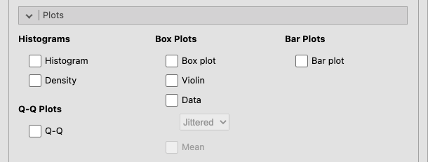
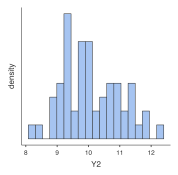
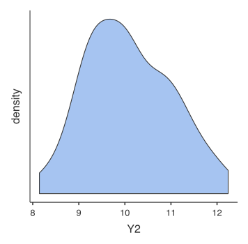
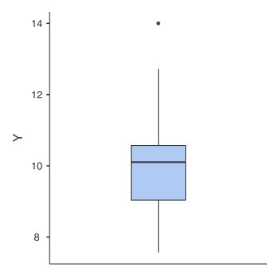
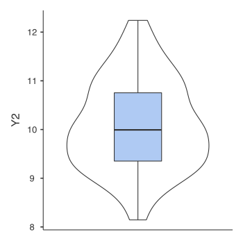
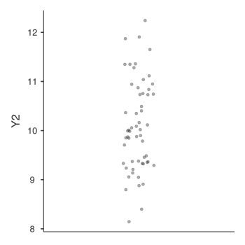

```{r, include = FALSE}
knitr::opts_chunk$set(echo = FALSE, message=FALSE, warning = FALSE, fig.align = 'center', out.width='80%')
require(ggplot2); require(ggplotify); require(cowplot)
```

# Exploration（探索）{#ch:exploration}

このメニューは，記述統計量の算出と基本的なグラフの作成に使用します。

## Descriptives（記述統計量）{#sec:exploration-descriptives}

*記述統計量*メニューには，要約統計量算出の機能，データ分布や分布の形を視覚化するのための機能が集められています。より複雑な分析を実施する前に，データの記述統計量にしっかり目を通しておくのはよいことです。

```{r exploration-descriptives, fig.cap='**Descriptives**'}
p <- ggdraw()+draw_image("imgs/01-exploration-descriptives.png")
p <- p+ draw_label('①', x= 0.03, y= 0.82, fontfamily = "HiraginoSans-W3", colour="red", size=14)
p <- p+ draw_label('②', x= 0.52, y= 0.78, fontfamily = "HiraginoSans-W3", colour="red", size=14)
p <- p+ draw_label('③', x= 0.52, y= 0.47, fontfamily = "HiraginoSans-W3", colour="red", size=14)
p <- p+ draw_label('④', x= 0.03, y= 0.27, fontfamily = "HiraginoSans-W3", colour="red", size=14)
p <- p+ draw_label('⑤', x= 0.03, y= 0.16, fontfamily = "HiraginoSans-W3", colour="red", size=14)
p <- p+ draw_label('⑥', x= 0.03, y= 0.09, fontfamily = "HiraginoSans-W3", colour="red", size=14)
p
```

1. データセットに含まれている変数の一覧です。
2. **Variables**（変数）　記述統計量の算出を行う変数を指定します。
3. **Split by**（分割）　グループごとに記述統計量を算出したい場合，ここにグールプ変数（*名義型*）を指定します。
4. **Frequency tables**（度数分布表）　記述統計量算出の対象が*名義型*または*順序型*変数の場合，ここにチェックを入れることで度数分布表が作成されます。
5. **Statistics**（統計量） 算出する統計量に関するオプション設定を行います。
6. **Plots**（作図）　作図のためのオプションを設定します。

### Statistics（統計量）{#sec:exploration-descriptives-statistics}
```{r exploration-descriptives-statistics, fig.cap='**Statistics**'}

```
+ **Sample Size**（標本サイズ）
  - **N**（測定値の個数）　分析対象の測定値の個数です。
  - **Missing**（欠損値）　欠損値の個数です。

+ **Percentile Values**（パーセンタイル値）
  - **Quartiles**（四分位数）　25%点，50%点（中央値），75%点を算出します。
  - **Cut points for** [ &emsp; ] **equal groups**（ｎ分位数）　データ全体をｎ等分した場合の境界点を求めます。初期値は「４」に設定されています。

+ **Dispersion**（ばらつき）
  - **Std. deviation**（標準偏差）　変数値の標準偏差を算出します。不偏分散をもとに値が表示されます。
  - **Variance**（分散）　変数値の分散を算出します。この値は不偏値です。
  - **Range**（範囲）　変数値最小値と最大値の差（幅）を算出します。
  - **Minimum**（最小値）　変数値の最小値を求めます。
  - **Maximum**（最大値）　変数値の最大値を求めます。
  - **S. E. Mean**（標準誤差）　標本平均値の標準誤差を算出します。

+ **Central Tendency**（中心傾向）
  - **Mean**（平均値）　変数値の算術平均を求めます。
  - **Median**（中央値）　変数値の中央値を求めます。
  - **Mode**（最頻値）　変数値の最頻値を求めます。
  - **Sum**（合計値）　変数値の合計値を求めます。

+ **Distribution**（分布）
  - **Skewness**（歪度）　変数値の分布が左右対称であるかどうかの指標（*歪度*）を算出します。分布が左右対称の場合，歪度は０になります。この値は分布が正規分布とどの程度｜乖離《かいり》しているかの指標の１つとして用いられます。
  - **Kurtosis**（尖度）　変数値の分布がどの程度ピーク付近に集中しているかの指標（*尖度*）を算出します。分布が正規分布とどの程度｜乖離《かいり》しているかの指標の１つとして用いられます。正規分布の場合，尖度は０になります。

+ **Normality**（正規性）
 - **Shapiro-Wilk**（シャピロ・ウィルク検定）　変数値が正規母集団から抽出された標本であるという帰無仮説についての検定を行います。このオプションで表示されるのはｐ値のみで，統計量（Ｗ）は表示されません。一般に，ｐ<.05の場合に正規分布から｜乖離《かいり》しているとみなされます。

### Plots（作図）{#sec:exploration-descriptives-plots}

```{r exploration-descriptives-plots, fig.cap='**Plots**'}

```

+ **Histograms**（ヒストグラム）　※*連続型*変数のみ
  - **Histogram**（ヒストグラム）　*ヒストグラム*を作成します。密度曲線グラフと重ねて作図することもできます。
```{r exploration-descriptives-plots-histogram, fig.cap='ヒストグラム',out.width='50%'}

```

  - **Density**（密度曲線）　度数分布を*カーネル平滑化*した密度曲線グラフを作成します。ヒストグラムに重ねて作図することもできます。
```{r exploration-descriptives-plots-density, fig.cap='密度曲線',out.width='50%'}

```

+ **Q-Q Plots**（Q-Qプロット）　※*連続型*変数のみ
  - **Q-Q**　変数値が正規分布からどの程度｜乖離《かいり》しているかを視覚的に示すQ-Qプロットを作成します。変数値の分布が正規分布の場合，グラフ上のデータ点は直線上に並びます。

```{r exploration-descriptives-plots-qq, fig.cap='Q-Qプロット',out.width='50%'}
knitr::include_graphics("imgs/01-exploration-descriptives-plots-qq.svg")
```

+ **Box Plots**（箱ひげ図）　※*連続型*変数のみ
  - **Box plot**（箱ひげ図）　中央値と四分位数を用いてデータの分布を視覚化します。バイオリン図やデータプロットと重ねて作図することもできます。

```{r exploration-descriptives-plots-boxplot, fig.cap='箱ひげ図',out.width='50%'}

```

  - **Violin**（バイオリン図）　カーネル確率密度を用いて変数値の分布を視覚化したバイオリン図と呼ばれる図を作成します。多くの場合，箱ひげ図と組み合わせて用いられます。
 
 ```{r exploration-descriptives-plots-violin, fig.cap='バイオリン図と箱ひげ図の組み合わせ',out.width='50%'}

```
 
  - **Data**（データプロット）　変数値の１つ１つを点としてグラフ上に示します。同じ値が複数ある場合，それらのデータ点は互いに重ならないように図示されます。データ点の重なりを防ぐ方法には，**jittered**（散らばり）と**stacked**（積み上げ）の２通りがあります。しばしば，箱ひげ図やバイオリン図と組み合わせて使用されます。

 ```{r exploration-descriptives-plots-data, fig.cap='「jittered」スタイルのデータプロット',out.width='50%'}

```
 
+ **Bar Plots**　※*名義型*，*順序型*変数のみ
  - **Bar plot**（棒グラフ）　棒グラフを作成します。

 ```{r exploration-descriptives-plots-barplot, fig.cap='棒グラフ',out.width='50%'}
knitr::include_graphics("imgs/01-exploration-descriptives-plots-barplot.svg")
```
 