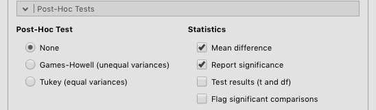
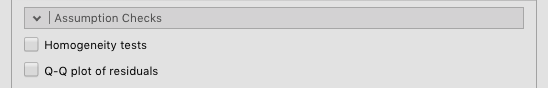
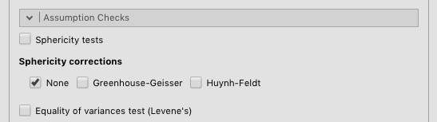
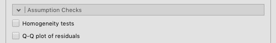
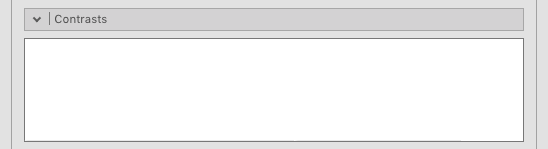

```{r, include = FALSE}
knitr::opts_chunk$set(echo = FALSE, message=FALSE, warning = FALSE, fig.align = 'center', out.width='80%')
require(ggplot2); require(ggplotify); require(cowplot);require(magick)
source( "snippets/macros.R" )
```

# ANOVA（分散分析）{#ch:anova}
*分散分析*（ANOVA）は，１つの*連続型*の従属変数と，１つあるいは複数の独立変数の影響関係について検討するための分析手法です。このメニューでは，通常の分散分析に加え，共変量を用いる場合，従属変数が多変量である場合など，さまざまなタイプの分散分析を扱います。

## One-Way ANOVA（１要因分散分析）{#sec:anova-oneway}
この「１要因分散分析」メニューは，「通常の」分散分析の手順を単純化したものです。説明変数（独立変数）は１種類しか使用できませんが，*ウェルチ法による分散分析*での分析も可能です。ウェルチ法による分散分析は，「すべてのグループで分散が等しい」という仮定が必要ないという点に強みがあります。なお，ウェルチ法による分散分析はウェルチ法による*独立標本ｔ検定*と同じものです。

また，このメニューでは従属変数を複数指定することもできますが，その場合には従属変数ごとに個別に分析が実行されます。

```{r anova-one, fig.cap='**One-Way ANOVA**'}
p <- image_read('imgs/03-anova-one.png')
p <- image_annotate(p,'①', size=14,color='red', font = 'Calibri',location = "+12+60")
p <- image_annotate(p,'②', size=14,color='red', font = 'Calibri',location = "+280+65")
p <- image_annotate(p,'③', size=14,color='red', font = 'Calibri',location = "+280+193")
p
```
1. `r varlist_li`
2. `r depvar_li`
3. `r groupvar_li`

+ `r variances_li`　
  - `r variances.dont.assume.equal_li`
  - `r variances.assume.equal_li`

+ `r missing.values_li`
  - `r missing.pairwise_li`
  - `r missing.listwise_li`
`r missing.note_li`

+ `r additional.statistics_li`
  - `r additional.descriptives.table_li`
  - `r additional.descriptives.plots_li`

+ `r assumption.checks_li`
  - `r assumption.shapiro_li`２群それぞれについて，統計量Ｗと有意確率ｐが算出されます。
  - `r assumption.qq_li`
  - `r assumption.levene_li`

### Post-Hoc Tests（事後検定）

主効果が有意であった場合の事後検定についての設定です。

```{r anova-one-posthoc, fig.cap='**Post-Hoc Tests**'}

```
+ **Post-Hoc Test**（事後検定）
    - **None**（なし） 　多重比較は行いません。
    - **Games-Howell (unequal variances)**（ゲームズ・ハウエル法［不等分散］）　*ゲームズ・ハウエル法*による多重比較を行います。ウェルチ法と同様に各水準の分散が等質であるという前提を用いない手法です。
    - **Tukey (equal variances)**（テューキー法［等分散］）　*テューキー法*による多重比較を行います。この方法は各水準の分散が等しいという前提に基づくものです。

+ **Statistics**（統計量）
    - **Mean difference**（平均値の差）　各水準間の平均値の差を算出します。
    - **Report significance**（有意性）　平均値の差の有意確率を算出します。
    - **Test results (t and df)**（検定結果［ｔおよび自由度］）　各水準間の差の有意性検定における統計量（ｔ）および自由度（ｄｆ）を出力します。
    - `r additional.comp.flag_li`


## ANOVA（分散分析）{#sec:anova-anova}

*分散分析*（ANOVA）は，１つの*連続型*の従属変数と，１つあるいは複数の独立変数（*名義型*または*順序型*）の影響関係を検討するための分析手法です。

分散分析は残差（誤差）が正規分布であり，かつすべてのグループで分散が等しいという前提のもとに検定が行われます。分散の等質性を仮定することが適切でないと考えられる場合には，代わりに*ウェルチの方法による分散分析*を使用することができます（ただし，ウェルチの検定が使用できるのは１要因の場合のみです）。また，データが正規分布であるという前提が適切でないと考えられる場合には，ノンパラメトリック検定である*クラスカル・ウォリス検定*を使用することもできます。

```{r anova-anova, fig.cap='**ANOVA**'}
p <- image_read('imgs/03-anova-anova.png')
p <- image_annotate(p,'①', size=14,color='red', font = 'Calibri',location = "+12+60")
p <- image_annotate(p,'②', size=14,color='red', font = 'Calibri',location = "+280+65")
p <- image_annotate(p,'③', size=14,color='red', font = 'Calibri',location = "+280+193")
p
```
1. `r varlist_li`
1. `r depvar_li`
1. `r fixed_li`

+ `r es_li`
  - `r es.eta_li`
  - `r es.partial.eta_li`
  - `r es.omega_li`

### Model（モデル）

`r model_txt`

```{r anova-anova-model, fig.cap='**Model**'}
p <- image_read('imgs/03-anova-anova-model.png')
p <- image_annotate(p,'①', size=14,color='red', font = 'Calibri',location = "+30+60")
p <- image_annotate(p,'②', size=14,color='red', font = 'Calibri',location = "+305+60")
p <- image_annotate(p,'③', size=14,color='red', font = 'Calibri',location = "+260+35")
p <- image_annotate(p,'④', size=14,color='red', font = 'Calibri',location = "+260+115")
p <- image_annotate(p,'⑤', size=14,color='red', font = 'Calibri',location = "+10+230")
p
```

1. `r model.component_li`
2. `r model.terms_li`
3. `r model.rarrow_li`
4. `r model.triarrow_li`
5. `r model.ss_li`

### Assumption Checks（前提条件チェック）

`r assumption_txt`

```{r anova-anova-assumption, fig.cap='**Assumption Checks**'}

```

+ `r assumption.homogen_li`
+ `r assumption.qq.res_li`

### Contrasts（対比）

`r contrast_txt`

```{r anova-anova-contrasts, fig.cap='**Contrasts**'}

```
```{r, results="asis"}
cat(readLines('snippets/Contrasts.md'), sep = '\n')
```

### Post Hoc Tests（事後検定）

`r posthoc_txt`

```{r anova-anova-posthoc, fig.cap='**Post Hoc Tests**'}
p <- image_read('imgs/03-anova-anova-posthoc.png')
p <- image_annotate(p,'①', size=14,color='red', font = 'Calibri',location = "+30+45")
p <- image_annotate(p,'②', size=14,color='red', font = 'Calibri',location = "+305+45")
p
```
```{r, results="asis"}
cat(readLines('snippets/PostHocTests.md'), sep = '\n')
```

### Estimated Marginal Means（推定周辺平均）

`r marginal_txt`

```{r anova-anova-marginal, fig.cap='**Estimated Marginal Means**'}
p <- image_read("imgs/03-anova-anova-marginal.png")
p <- image_annotate(p,'①', size=14,color='red', font = 'Calibri',location  = "+30+55")
p <- image_annotate(p,'②', size=14,color='red', font = 'Calibri',location = "+280+40")
p
```

```{r, results="asis"}
cat(readLines('snippets/MarginalMeans.md'), sep = '\n')
```

## Repeated Measures ANOVA（反復測定分散分析）{#sec:anova-repeated}

*反復測定分散分析*は，*連続型*の従属変数と，１つあるいは複数の独立変数（*名義型*または*順序型*）の影響関係を検討するための分析手法で，１つ以上の独立変数が*被験者内要因*（「前・後」など，異なる水準の測定値を同一被験者から得るもの）である場合に用いられます。この分析では*共変量*を使用すること（*反復測定共分散分析*）も可能です。

なお，この分析で使用できるデータは，データ行１行につき被験者１名分の測定値が入力された「*ワイド形式*」である必要があります。また，反復測定分散分析のノンパラメトリック版として*フリードマン検定*がありますが，この検定は１要因の場合しか扱うことができません。


```{r anova-repeated, fig.cap='**Repeated Measures ANOVA**'}
p <- image_read('imgs/03-anova-repeated.png')
p <- image_annotate(p,'①', size=14,color='red', font = 'Calibri',location = "+15+55")
p <- image_annotate(p,'②', size=14,color='red', font = 'Calibri',location = "+280+70")
p <- image_annotate(p,'③', size=14,color='red', font = 'Calibri',location = "+350+90")
p <- image_annotate(p,'④', size=14,color='red', font = 'Calibri',location = "+280+115")
p <- image_annotate(p,'⑤', size=14,color='red', font = 'Calibri',location = "+280+220")
p <- image_annotate(p,'⑥', size=14,color='red', font = 'Calibri',location = "+280+440")
p <- image_annotate(p,'⑦', size=14,color='red', font = 'Calibri',location = "+280+515")
p
```

1. `r varlist_li`
2. **Repeated Measures Factors**（反復測定要因）　繰り返し要因，および各水準のラベルを設定します。
3. 繰り返し要因の要因ラベル（名前）を設定します。ラベルをクリックして編集します。
4. 「１回目・２回目・３回目…」など，繰り返し水準のラベル（名前）を設定します。ラベルをクリックして編集します。
3. **Repeated Measures Cells**（反復測定変数）　繰り返し要因の各水準に対応する測定値が含まれる変数を指定します。
4. **Between Subject Factors**（被験者間要因）　繰り返し測定を含まない要因を指定します。
5. `r covar_li`
+ `r es_li`
    - `r es.eta_li`
    - `r es.partial.eta_li`
+ **Dependent Variable Label**（従属変数ラベル）　分析結果に表示される従属変数の名前を設定します。

### Model（モデル）

`r model_txt`

```{r anova-repeated-model, fig.cap='**Model**'}
p <- image_read("imgs/03-anova-repeated-model.png")
p <- image_annotate(p,'①', size=14,color='red', font = 'Calibri',location = "+30+75")
p <- image_annotate(p,'②', size=14,color='red', font = 'Calibri',location = "+305+75")
p <- image_annotate(p,'③', size=14,color='red', font = 'Calibri',location = "+265+35")
p <- image_annotate(p,'④', size=14,color='red', font = 'Calibri',location = "+265+115")

p <- image_annotate(p,'⑤', size=14,color='red', font = 'Calibri',location = "+30+265")
p <- image_annotate(p,'⑥', size=14,color='red', font = 'Calibri',location = "+305+265")
p <- image_annotate(p,'⑦', size=14,color='red', font = 'Calibri',location = "+265+240")
p <- image_annotate(p,'⑧', size=14,color='red', font = 'Calibri',location = "+265+320")
p <- image_annotate(p,'⑨', size=14,color='red', font = 'Calibri',location = "+10+435")
p
```

1. **Repeated Measures Components**（反復測定要素）　分析に含まれる要素（コンポーネント）のうち反復測定のものの一覧です。
2. `r model.terms_li`
3. `r model.rarrow_li`
4. `r model.triarrow_li`
1. **Between Subjects Components**（被験者間要素）　分析に含まれる要素（コンポーネント）のうち被験者間のものの一覧です。
2. `r model.terms_li`
3. `r model.rarrow_li`
4. `r model.triarrow_li`
5. `r model.ss_li`

### Assumption Checks（前提条件チェック）
`r assumption_txt`

```{r anova-repeated-assumption, fig.cap='**Assumption Checks**'}

```
+ `r assumption.sphericity_li`
+ `r assumption.sphericity.corrections_li`
  - `r assumption.sphericity.corrections.none_li`
  - `r assumption.sphericity.corrections.GG_li`
  - `r assumption.sphericity.corrections.HF_li`
+ **Equality of variances test (Levene's)**（分散等質性検定）　分散の等質性検定（*ルビーン検定*）を行います。

### Post Hoc Tests（事後検定）
`r posthoc_txt`

```{r anova-repeated-posthoc, fig.cap='**Post Hoc Tests**'}
p <- image_read("imgs/03-anova-repeated-posthoc.png")
p <- image_annotate(p,'①', size=14,color='red', font = 'Calibri',location = "+30+60")
p <- image_annotate(p,'②', size=14,color='red', font = 'Calibri',location = "+305+45")
p
```

```{r, results="asis"}
cat(readLines('snippets/PostHocTests.md'), sep = '\n')
```

### Estimated Marginal Means（推定周辺平均）

`r marginal_txt`

```{r anova-repeated-marginal, fig.cap='**Estimated Marginal Means**'}
p <- image_read("imgs/03-anova-repeated-marginal.png")
p <- image_annotate(p,'①', size=14,color='red', font = 'Calibri',location = "+30+65")
p <- image_annotate(p,'②', size=14,color='red', font = 'Calibri',location = "+280+40")
p
```

```{r, results="asis"}
cat(readLines('snippets/MarginalMeans.md'), sep = '\n')
```

## ANCOVA（共分散分析）{#sec:anova-ancova}

*共分散分析*（ANCOVA）は，１つの*連続型*の従属変数と，１つあるいは複数の独立変数（*名義型*または*順序型*）および１つ以上の*共変量*（*連続型*）の影響関係について検討するための分析手法です。共分散分析は，共変量を用いるという点を除けば分散分析と本質的に同じものです。

```{r anova-ancova, fig.cap='**ANCOVA**'}
p <- image_read("imgs/03-anova-ancova.png")
p <- image_annotate(p,'①', size=14,color='red', font = 'Calibri',location = "+15+55")
p <- image_annotate(p,'②', size=14,color='red', font = 'Calibri',location = "+280+65")
p <- image_annotate(p,'③', size=14,color='red', font = 'Calibri',location = "+280+120")
p <- image_annotate(p,'④', size=14,color='red', font = 'Calibri',location = "+280+240")
p
```

1. `r varlist_li`
1. `r depvar_li`
1. `r fixed_li`
1. `r covar_li`
+ `r es_li`
  - `r es.eta_li`
  - `r es.partial.eta_li`
  - `r es.omega_li`

### Model（モデル）

`r model_txt`

```{r anova-ancova-model, fig.cap='**Model**'}
p <- image_read("imgs/03-anova-ancova-model.png")
p <- image_annotate(p,'①', size=14,color='red', font = 'Calibri',location = "+30+60")
p <- image_annotate(p,'②', size=14,color='red', font = 'Calibri',location = "+305+60")
p <- image_annotate(p,'③', size=14,color='red', font = 'Calibri',location = "+265+40")
p <- image_annotate(p,'④', size=14,color='red', font = 'Calibri',location = "+265+115")
p
```

1. `r model.component_li`
2. `r model.terms_li`
3. `r model.rarrow_li`
4. `r model.triarrow_li`
5. `r model.ss_li`

### Assumption Checks（前提条件チェック）

`r assumption_txt`

```{r anova-ancova-assumption, fig.cap='**Assumption Checks**'}

```
+ `r assumption.homogen_li`
+ `r assumption.qq.res_li`

### Contrasts（対比）
```{r anova-ancova-contrasts, fig.cap='**Contrasts**'}

```
```{r, results="asis"}
cat(readLines('snippets/Contrasts.md'), sep = '\n')
```

### Post Hoc Tests（事後検定）
多重比較の設定を行います。

```{r anova-ancova-posthoc, fig.cap='**Post Hoc Tests**'}
p <- image_read("imgs/03-anova-ancova-posthoc.png")
p <- image_annotate(p,'①', size=14,color='red', font = 'Calibri',location = "+30+60")
p <- image_annotate(p,'②', size=14,color='red', font = 'Calibri',location = "+305+60")
p <- image_annotate(p,'③', size=14,color='red', font = 'Calibri',location = "+265+40")
p <- image_annotate(p,'④', size=14,color='red', font = 'Calibri',location = "+265+115")
p
```
```{r, results="asis"}
cat(readLines('snippets/PostHocTests.md'), sep = '\n')
```

### Estimated Marginal Means（推定周辺平均）

`r marginal_txt`

```{r anova-ancova-marginal, fig.cap='**Estimated Marginal Means**'}
p <- image_read("imgs/03-anova-ancova-marginal.png")
p <- image_annotate(p,'①', size=14,color='red', font = 'Calibri',location = "+30+55")
p <- image_annotate(p,'②', size=14,color='red', font = 'Calibri',location = "+280+40")
p
```

```{r, results="asis"}
cat(readLines('snippets/MarginalMeans.md'), sep = '\n')
```

## MANCOVA（多変量共分散分析）{#sec:anova-mancova}
*多変量分散分析*（MANOVA）は，複数の従属変数と１つ以上の独立変数の関係について検討する際に使用されます。また，多変量分散分析で*共変量*を使用する場合は*多変量共分散分析*（MANCOVA）と呼ばれます。

```{r anova-mancova, fig.cap='**MANCOVA**'}
p <- image_read('imgs/03-anova-mancova.png')
p <- image_annotate(p,'①', size=14,color='red', font = 'Calibri',location = "+20+55")
p <- image_annotate(p,'②', size=14,color='red', font = 'Calibri',location = "+280+65")
p <- image_annotate(p,'③', size=14,color='red', font = 'Calibri',location = "+280+190")
p <- image_annotate(p,'④', size=14,color='red', font = 'Calibri',location = "+280+315")
p
```
1. `r varlist_li`
1. `r depvar_li`
1. **Factors**（要因）　平均値の差について検討する要因（独立変数）を指定します。　※*名義型*または*順序型*変数のみ
1. `r covar_li`

+ **Multivariate Statistics**（多変量統計量）
    - **Pillai's Trace**（ピライのトレース）　*ピライのトレース*を算出します。
    - **Wilks' Lambda**（ウィルクスのラムダ）　*ウィルクスのラムダ*（λ）を算出します。
    - **Hotteling's Trace**（ホテリングのトレース）　*ホテリングのトレース*を算出します。
    - **Roy's Largest Root**（ロイの最大根）　*ロイの最大根*を算出します。

+ `r assumption.checks_li`
    - **Box's M test**（ボックスのＭ検定）　分散共分散行列の同質性について*ボックスのＭ検定*を実施します。
    - **Shapiro-Wilk test**（シャピロ・ウィルク検定）　変数値が正規分布から｜乖離《かいり》していないかどうかを見るために，*シャピロ・ウィルク検定*を実施します。
    - **Q-Q plot of multivariate normality**（多変量正規Ｑ‐Ｑプロット）　多変量の正規*Ｑ‐Ｑプロット*を作図します。"

## **Non-Parametric**（ノンパラメトリック検定）{-}
通常の分散分析では，測定値が*正規分布*あるいは*多変量正規分布*であることが前提となります。そのような前提をおくことが適切でないと考えられる場合，*ノンパラメトリック*な検定を使用することも可能です。ただし，一般にノンパラメトリック検定はパラメトリック検定に比べて第２種の誤り率（実際には差があるのにそれを見過ごしてしまう確率）が高くなる傾向にあります。

## One-Way ANOVA [Kruskal-Wallis]（クラスカル・ウォリス検定）
*クラスカル・ウォリス検定*は，*連続型*の従属変数と*名義型*または*順序型*の説明変数（独立変数）の関係について検討する際に使用されます。分散分析（ANOVA）とよく似た分析手法ですが，ノンパラメトリック検定であるために分析に必要な前提条件が少なく済むという利点があります。ただし，分析に使用できる独立変数は１つに限定されます。

```{r anova-kruskal, fig.cap='**Kruskal-Wallis**'}
p <- image_read('imgs/03-anova-kruskal.png')
p <- image_annotate(p,'①', size=14,color='red', font = 'Calibri',location = "+25+55")
p <- image_annotate(p,'②', size=14,color='red', font = 'Calibri',location = "+280+65")
p <- image_annotate(p,'③', size=14,color='red', font = 'Calibri',location = "+280+190")
p <- image_annotate(p,'④', size=14,color='red', font = 'Calibri',location = "+5+268")
p
```
1. `r varlist_li`
1. `r depvar_li`
1. `r groupvar_li`
1. **DSCF pairwise comparisons**（DSCF多重比較）　*DSCF法*（ドゥワス・スティール・クリッチロウ・フリグナー法）による多重比較を実施します。

## Repeated Measures ANOVA [Friedman]（フリードマン検定）
反復測定分散分析に相当するノンパラメトリック分析の手法です。
*フリードマン検定*は，*連続型*の従属変数と反復測定された*名義型*または*順序型*の説明変数（独立変数）の関係について検討する際に使用されます。反復測定分散分析とよく似た分析手法ですが，ノンパラメトリック検定であるために分析に必要な前提条件が少なく済むという利点があります。ただし，分析に使用できる独立変数は１つに限定されます。

```{r anova-friedman, fig.cap='**Friedman**'}
p <- image_read('imgs/03-anova-friedman.png')
p <- image_annotate(p,'①', size=14,color='red', font = 'Calibri',location = "+25+55")
p <- image_annotate(p,'②', size=14,color='red', font = 'Calibri',location = "+305+95")
p <- image_annotate(p,'③', size=14,color='red', font = 'Calibri',location = "+5+270")
p <- image_annotate(p,'④', size=14,color='red', font = 'Calibri',location = "+5+295")
p <- image_annotate(p,'⑤', size=14,color='red', font = 'Calibri',location = "+5+320")
p
```
1. `r varlist_li`
1. **Measures**（測定値）　分析対象の測定値を指定します。
1. **Pairwise comparisons (Durbin-Conover)**（多重比較［ダービン・コノバー］）　*ダービン・コノバー法*による多重比較を実施します。　
1. **Descriptives**（記述統計量）　平均値および中央値を算出します。
1. **Descriptive plot**（記述統計量の作図）
    - **Means**（平均値）　平均値の図を作成します。
    - **Medians**（中央値）　中央値の図を作成します。
